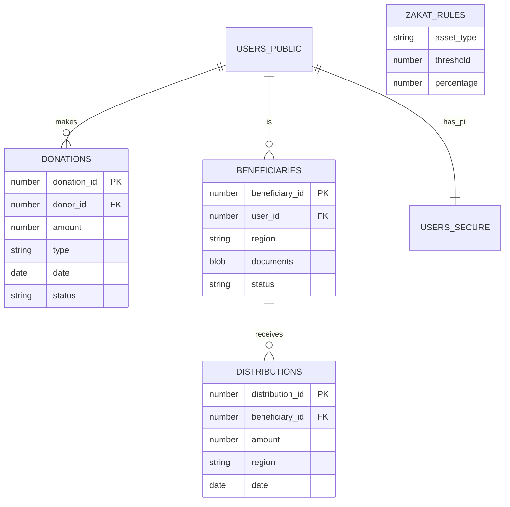

# Database Schema Diagram

```mermaid
erDiagram
    USERS_PUBLIC ||--o{ DONATIONS : makes
    USERS_PUBLIC ||--o{ BENEFICIARIES : is
    USERS_PUBLIC ||--|| USERS_SECURE : has_pii
    
    DONATIONS {
        number donation_id PK
        number donor_id FK
        number amount
        string type
        date date
        string status
    }
    
    BENEFICIARIES ||--o{ DISTRIBUTIONS : receives
    BENEFICIARIES {
        number beneficiary_id PK
        number user_id FK
        string region
        blob documents
        string status
    }
    
    DISTRIBUTIONS {
        number distribution_id PK
        number beneficiary_id FK
        number amount
        string region
        date date
    }
    
    ZAKAT_RULES {
        string asset_type
        number threshold
        number percentage
    }
```
